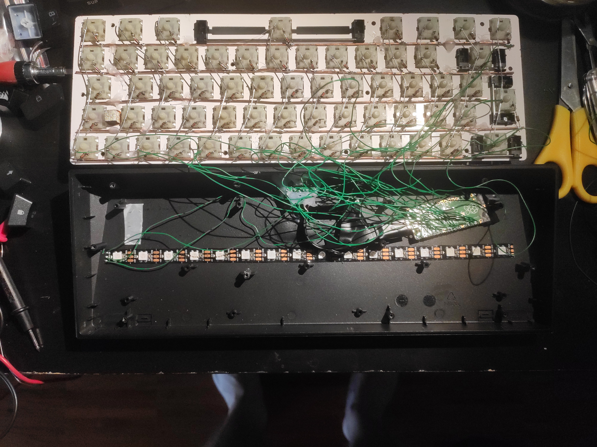
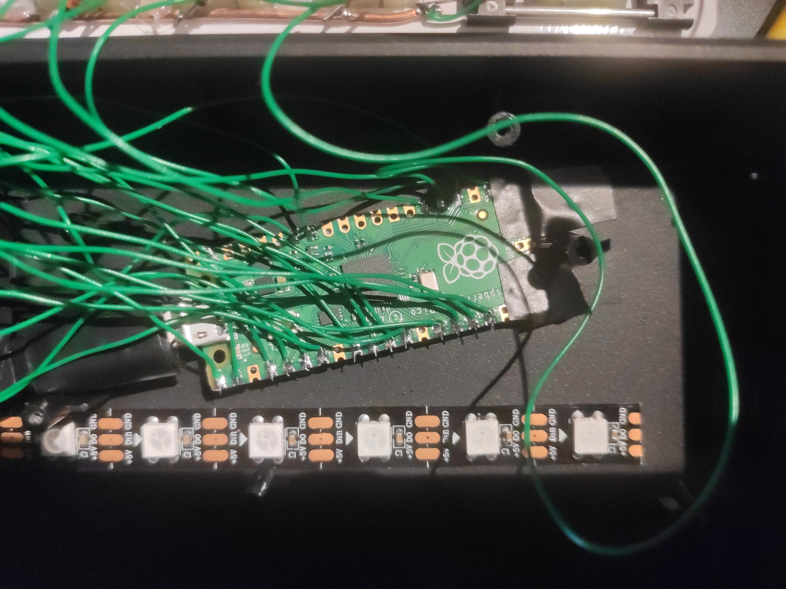
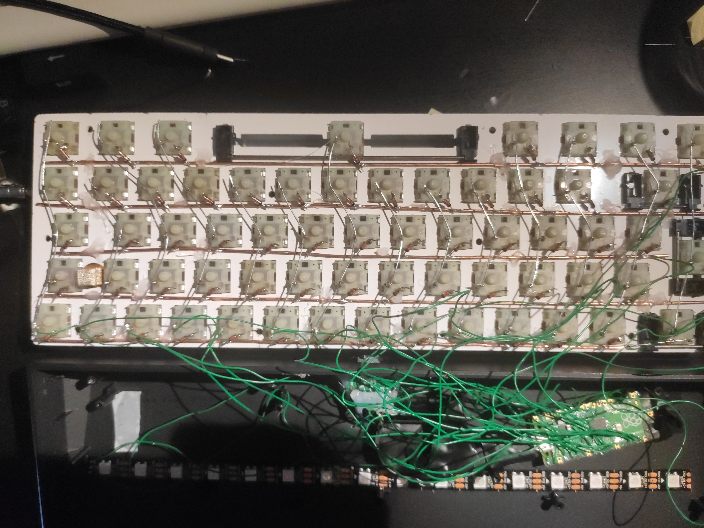
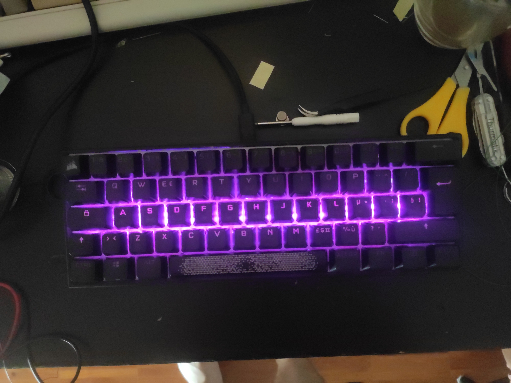
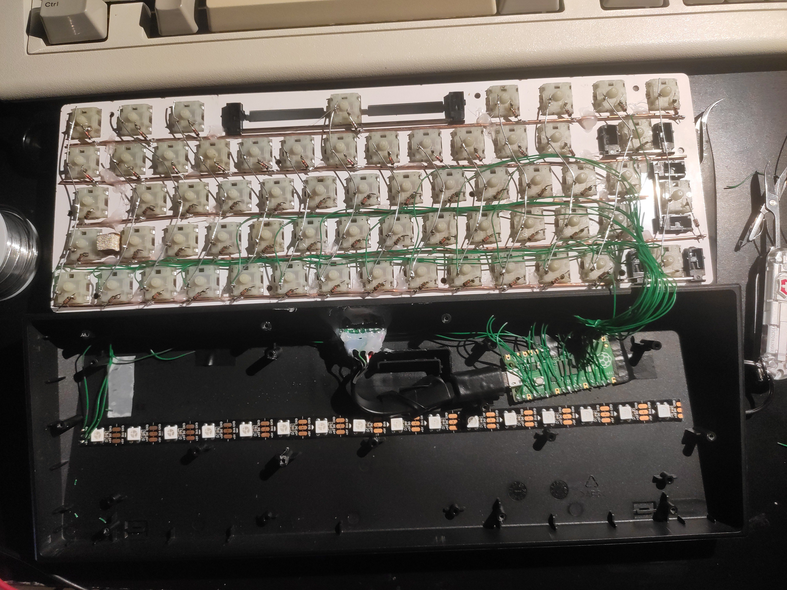

# IBM model Pi

## Wiring

row1 = board.GP16
row2 = board.GP17
row3 = board.GP18
row4 = board.GP19
row5 = board.GP20

col1 = board.GP0
col2 = board.GP1
col3 = board.GP2
col4 = board.GP3
col5 = board.GP4
col6 = board.GP5
col7 = board.GP6
col8 = board.GP7
col9 = board.GP8
col10 = board.GP9
col11 = board.GP10
col12 = board.GP11
col13 = board.GP12
col14 = board.GP13

## The software 

First of all you have to install circuit python on the Pi pico.
To do so, follow the instruction on [the adafruit site](https://learn.adafruit.com/getting-started-with-raspberry-pi-pico-circuitpython/circuitpython)

Next follow the [getting started guide by KMK team](https://github.com/KMKfw/kmk_firmware/blob/master/docs/Getting_Started.md)

Now you are ready to just copy the repo code and paste to the pico storage

## If you added extra cables to the GPIO0 and GPIO16
then you can uncomment the code in the [boot.py](./boot.py).

What the code does it hides a pico storage. You can still access.
To do so, connect the extra cables (GPIO0 and GPIO16) during boot and the storage should appear.

### Happy hacking

## Some pics

